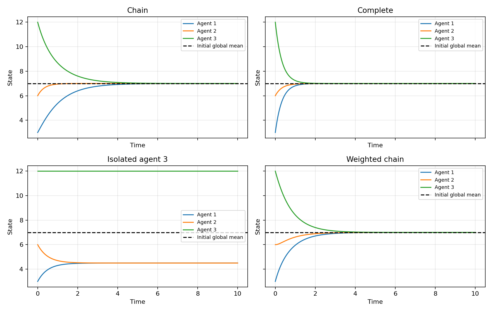

# 第一周：Python 仿真

[返回第一周笔记](./) · [返回科研进度](../) · [下载 Python 源码](./consensus.py)

## 1. 安装与运行

在终端安装依赖：

```bash
python -m pip install numpy matplotlib
python consensus.py
```

先下载上面的 consensus.py，在该文件所在目录运行。程序将展示四种拓扑的对照图，并在脚本同目录保存 consensus-comparison.png。全局平均值参考线并不表示孤立节点情形也会收敛到该值。

## 2. 基础仿真完整代码

下面是当天入门模型，可以直接复制运行。下载版在此基础上增加四拓扑比较与步长检查。

```python
import numpy as np
import matplotlib.pyplot as plt

L = np.array([
    [1, -1, 0],
    [-1, 2, -1],
    [0, -1, 1]
], dtype=float)

h = 0.01
T = 10.0
steps = round(T / h)
time = np.arange(steps + 1) * h

states = np.zeros((steps + 1, 3))
states[0] = [3, 6, 12]

for k in range(steps):
    states[k + 1] = states[k] - h * (L @ states[k])

print('最终状态：', states[-1])
print('初始平均值：', states[0].mean())
print('最终平均值：', states[-1].mean())
print('特征值：', np.linalg.eigvalsh(L))

for i in range(3):
    plt.plot(time, states[:, i], label=f'Agent {i + 1}')

plt.axhline(states[0].mean(), color='black', linestyle='--',
            label='Initial average')
plt.xlabel('Time')
plt.ylabel('State')
plt.title('Consensus on a three-agent chain')
plt.legend()
plt.grid(True)
plt.show()
```

## 3. 代码与数学的对应

| 代码 | 含义 |
| --- | --- |
| import numpy as np | 数值运算库的简称 |
| np.array(..., dtype=float) | 建立浮点数组，避免整数存储丢失小数 |
| L.shape | 矩阵形状 (3, 3) |
| states[k].shape | 状态一维数组形状 (3,) |
| L @ states[k] | 矩阵乘向量 |
| L * states[k] | 逐元素运算并广播，不是矩阵乘法 |
| np.zeros((steps + 1, 3)) | 每行一个时刻，每列一个智能体 |
| np.arange(steps + 1) * h | 从初始时刻到终止时刻的时间网格 |
| states[k + 1] = states[k] - h * (L @ states[k]) | 显式欧拉同步更新 |
| states[k, i] | 第 k 步、第 i 列的状态；Python 从 0 编号 |
| states[:, i] | 一个智能体的完整时间记录 |
| states[-1] | 最后一个时刻 |
| states[0].mean() | 初始平均值 |
| np.linalg.eigvalsh(L) | 对实对称矩阵计算升序特征值 |
| plt.plot(time, states[:, i]) | 将时间与状态逐点配对绘图 |
| plt.axhline(...) | 水平参考线 |
| plt.legend() / plt.grid(True) / plt.show() | 图例、网格、显示 |

1000 次更新需要记录 1001 个时刻，因为包含 t=0。普通列表乘 2 会重复列表；NumPy 数组乘 2 会把各元素乘 2。

eigvalsh 只用于这里的实对称矩阵，不能直接用于非对称有向拉普拉斯矩阵。

## 4. 对照实验的理论预测

保持初值 (3,6,12)、h=0.01、T=10 相同，只改变 L。

| 模型 | 最终极限 | 要观察的现象 |
| --- | --- | --- |
| 链式连接 | (7,7,7) | 全局平均一致 |
| 全部互连 | (7,7,7) | 最慢连续衰减率由 1 提升到 3 |
| 3 号孤立 | (4.5,4.5,12) | 分组一致，总平均值仍为 7 |
| 对称加权链 | (7,7,7) | 权重改变过程，不改变普通平均值 |

有限仿真时间的状态只是接近极限，不要求精确相等。原始基础仿真已验证；下载版四拓扑脚本是整理时提供的可复现练习，不代表当天已保存全部实验图。


## 整理时运行的参考结果

下图由本页下载脚本生成，使用初值 (3,6,12)、h=0.01、T=10。整理时已运行四种拓扑并检查平均值漂移；这是参考运行结果，不替代个人实验记录。



## 5. 步长与精度检查

对称 L 的最大特征值可以通过以下代码获得：

```python
eigenvalues = np.linalg.eigvalsh(L)
lambda_max = eigenvalues[-1]
print('步长上限：', 2 / lambda_max)
```

该示例 L 存在正特征值。若 L 全零，不能除以零，此时状态恒定。

先保证 $0<h<2/\lambda_{\max}$，再比较 h=0.01 与 h=0.005 在同一物理时刻的结果。稳定性是收敛的要求，精度还需另行检查。

[返回第一周笔记](./)
